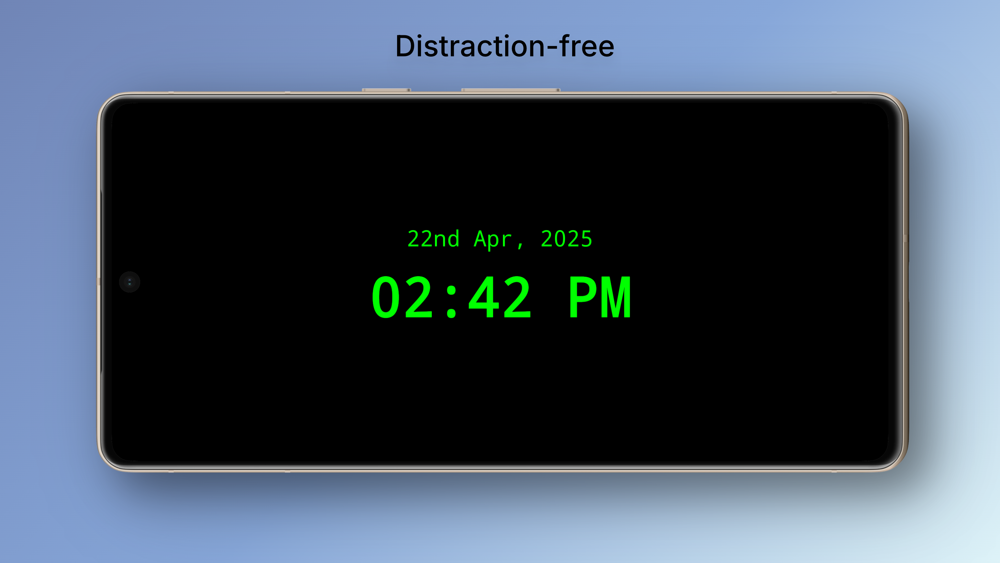
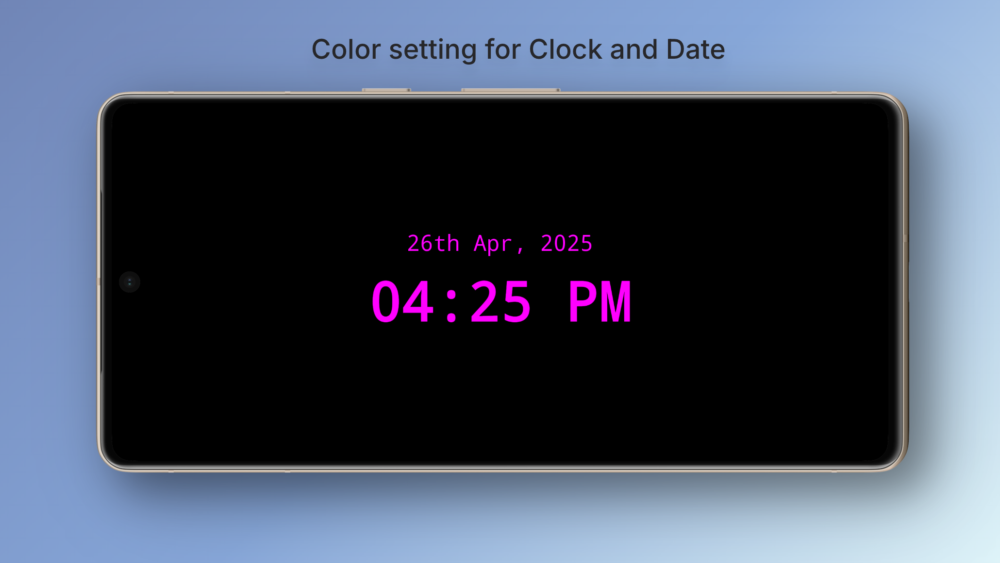

# Night Clock (Always On)

A minimal, distraction-free clock that keeps your screen always on — perfect for your bedside or desk.  
Simple, clean, and designed to shine through the night without burning your eyes.

## Features

- **Always On Display** — Your clock stays visible, no screen dimming.
- **Custom Clock Colors** — Choose from Neon Green, Magenta Pink, Electric Yellow, or Pure White.
- **Optional Date Display** — Show or hide the date based on your preference.
- **Landscape & Portrait Support** — Rotate freely even if device rotation is disabled.

## Screenshots

|                  Distraction-free                  |                    Customizable                    |                Custom Clock Colors                 |
|:--------------------------------------------------:|:--------------------------------------------------:|:--------------------------------------------------:|
|  |  |  |

## Contributing

Contributions are warmly welcome! ✨

If you have ideas for new features, improvements, or bug fixes:
- Fork this repo 🍴
- Create a new branch 🔧
- Make your changes 🌟
- Submit a Pull Request 📬

Guidelines:
Please keep your code clean, readable, and respectful of the app’s minimalistic spirit.

## Support & Donations

If you find this project helpful, consider fueling the creator’s late-night coding sessions! 🙏

[Buy me a Coffee](https://buymeacoffee.com/amitmerchant)

## License

This project is **closed source** and **all rights are reserved**.

Unauthorized use, copying, modification, distribution, or sale of this software is strictly prohibited without prior written permission from the author.

For licensing inquiries, please contact: [bullredeyes@gmail.com](mailto:bullredeyes@gmail.com)